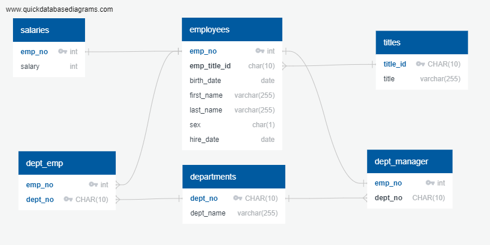
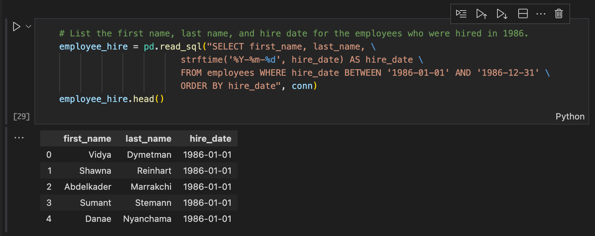

# SQL-Challenge

 This assignment requires students to do a research project about people who were employed at the fictitious company **Pewlett Hackard** during the 1980s and 1990s.

---

## Aims

### 1. Data Modelling

Using the csv tables provided, create an ERD

### 2. Data Engineering

Create a table schema in **pgadmin** and import each csv file into corresponding SQL table

### 3. Data Analysis

Perform a series of SQL queries based on questions provided

### 4. Bonus

Create a Jupyter notebook for the bonus analysis

---

## Results

### 1. Data Modelling

ERD SQL output: [QuickDBD-employeeSQL.sql](./EmployeeSQL/QuickDBD-employeeSQL.sql)

### 2. Data Engineering

Lines 1 to 51 of [EmployeeSQL](./EmployeeSQL/employeeSQL.sql) create the tables. Data was imported into each table using the **pgadmin** *Table Import/Export data* menu.

### 3. Data Analysis

Lines 52 to 125 of [EmployeeSQL](./EmployeeSQL/employeeSQL.sql) answer the following questions (an image of first 10 lines of the **pgadmin** output is shown for each question)

1. List the employee number, last name, first name, sex, and salary of each employee.

2. List the first name, last name, and hire date for the employees who were hired in 1986.

3. List the manager of each department along with their department number, department name, employee number, last name, and first name.

4. List the department number for each employee along with that employee’s employee number, last name, first name, and department name.

5. List the first name, last name, and sex of each employee whose first name is Hercules and whose last name begins with the letter B.

6. List each employee in the Sales department, including their employee number, last name, and first name.

7. List each employee in the Sales and Development departments, including their employee number, last name, first name, and department name.

8. List the frequency counts, in descending order, of all the employee last names (that is, how many employees share each last name).

### 4. Bonus

A jupyter notebook [EmployeeSQLAlchemy.ipynb](./EmployeeSQLAlchemy.ipynb) was created in which the employees table was created in [EmployeeSQL/PewlettHackard.sqlite](./EmployeeSQL/PewlettHackard.sqlite), an SQLite database, by importing the [employees.csv](./EmployeeSQL/employees.csv) file into a pandas dataframe and writing to an SQL table object using the **SQLalchemy** library. Query number 2 above was performed on the database. The output from VSCode is shown below.

## Acknowledgements
- Advice on overcoming postgreSQL DATESTYLE incompatibility when importing the employees.csv file was gratefully received on Slack from [@Henry Leighton](https://mon-data-feb-2023.slack.com/archives/C04FHDYRLFM/p1682740802239079)
- *Customizing date parser* in [Tricks to parse date columns with Pandas read_csv()
](https://github.com/BindiChen/machine-learning/blob/main/data-analysis/012-parse-date-with-read_csv/parse-date-column-with-read_csv.ipynb) was used to overcome the same incompatibility when reading employees.csv date fields into pandas for populating the employees table in the bonus jupyter notebook.